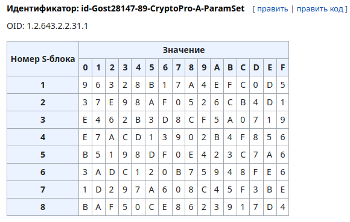
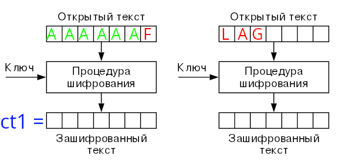
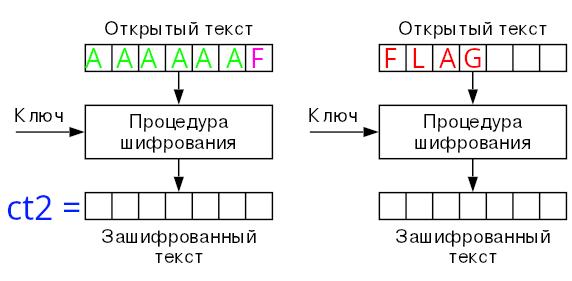
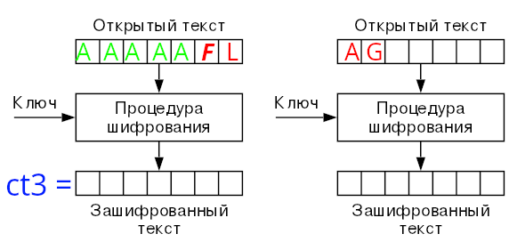

# marcle

_Author: [@y73n0k](https://github.com/y73n0k)_

> Слышал, что AES в такой конфигурации уязвим, поэтому выбрал отечественный аналог. С ним-то точно не будет проблем...

## Решение

Проведём ресёрч: первое, что бросается в глаза это `S_BOX` - некоторая функция, которая преобразует $n$-битное сообщение в $m$-битное, которая зачастую используется в `блочных шифрах`.

В условии дана подсказка: наш блочный шифр - отечественная разработка. 

По запросу `отечественный блочный шифр` получаем [статью ГОСТ 28147-89](https://ru.wikipedia.org/wiki/%D0%93%D0%9E%D0%A1%D0%A2_28147-89)

В статье находим значения нашего `S_BOX`, поэтому делаем предположение, что скрипт - реализация ГОСТ 28147-89 (можно убедиться что это действительно так, исследовав алгоритм, а также по изучив проверки длин блоков ключа и текста в функции `encrypt`)

Наш алгоритм симметричного блочного шифрования работает в режиме простой замены, то есть каждый блок сообщения шифруется независимо от других.

На самом деле для решения важен именно тот факт, что шифруется `data + flag`, где `data` - передаваемое сообщение.

Пусть длина блока открытого текста $L$.

Тогда, если передать на шифрование сообщение длины $L - 1$, то получим такую картинку:

Запоминаем `ct1`. Запускаем процесс перебора последнего байта блока:

В момент, когда `ct1 == ct2` мы с уверенностью можем сказать, что восстановили первый байт флага (так как функция шифрования однозначна для данного открытого текста).

Зная первый байт флага отправим сообщение длины $L - 2$. Мы знаем, какой байт находится на $L - 1$ месте после добавления флага к открытому тексту, поэтому достаточно перебрать последний байт.

Продолжаем процесс перебора последнего байта, пока не восстановим флаг.

[Решение](./writeup/solution.py)
