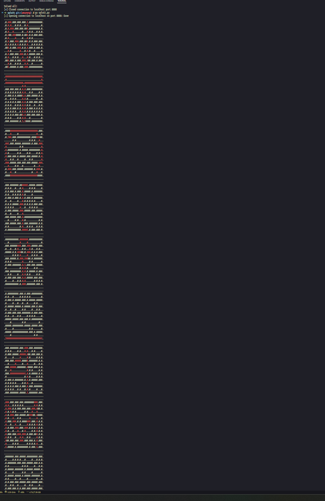

# Amazeng

_Author: [@LeKSuS-04](https://github.com/LeKSuS-04)_

> ...вы просыпаетесь в темном сыром помещении. Вокруг вас почти ничего не видно. Только тонкий лучик света светит откуда-то из-за угла. Проследовав за ним по узкому коридору вы переходите в другое помещение, по размеру напоминающее первое. В этот раз у вас уже не один маршрут – из этой комнаты есть два выхода. Вас посещает мысль о том, что вы, должно быть, в лабиринте. Благо он оказался небольшим – спустя около часа скитаний вы видите яркий свет. “Выход!” – воскликнули вы, устремившись навстречу свету. Однако, выйдя из лабиринта… вы просыпаетесь в темном сыром помещении.
>
> Все буквы во флаге - строчные (маленькие)!

## Решение

После исследования таска обнаруживаем, что от нас хотят, чтобы мы решали лабиринты. Много кто знает (а кто не знает -- может нагуглить :D), что подобного рода задачи легко решаются алгоритмами на графах; в частности -- bfs или dfs. Быстро запрограмировав решалку лабиринтов на коленке, успешно справляемся со всеми 59 лабиринтами, после чего видим в консоли:

```
You have solved all my challenges! But where's the flag?...
```

Озадаченные, думаем, что делать дальше. Можно попробовать порешать руками, попробовать выводить все пути для дебага или просто позапускать еще несколько раз. В общем подобывать иинформацию любыми возможными способами. В любом случае, можно заметить, что для первого лабиринта путь до выхода всегда один и тот же. На самом деле для всех лабиринтов путь до выхода один и тот же. Конкретно для первого же лабиринта он выглядит вот так:

```
.................................
...###.............E.............
...#.#.............#.............
...#.###...........#.............
...#...#...........#.............
...#...###.........#.............
...#.....#.........#.............
...#.....###.......#.............
...#.......#.......#.............
...#.......###.....#.............
...#.........#.....#.............
...#.........###...#.............
...#...........#...#.............
...#...........###.#.............
...#.............#.#.............
...S.............###.............
.................................
```

Несложно увидеть тут букву `N`. Это уже должно навеять на определенные мысли о том, где искать флаг. Посмотрев же на пути для нескольких остальных лабиринтов, понимаем, что путь до выхода из каждого лабиринта -- это одна буква во флаге.

Осталось это все как-то прочитать. Один возможный вариант -- печатать все лабиринты, с раскрашенными путями. Скрипт, который это делает, лежит здесь: [sploit/sploit.py](./sploit/sploit.py)

Вывод у него получается такой:


