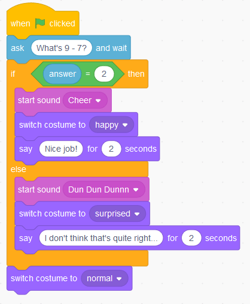
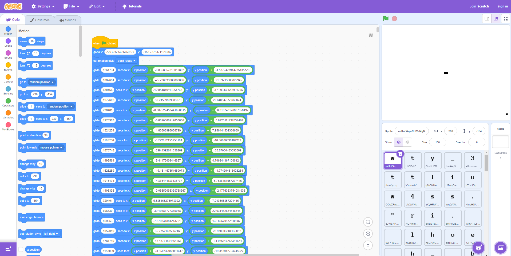
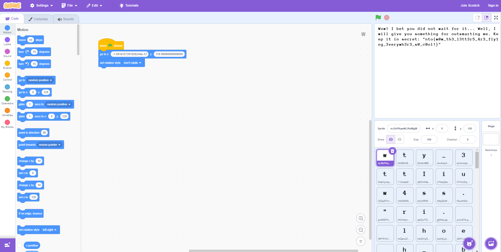

# Just a Scratch

_Author: [@LeKSuS-04](https://github.com/LeKSuS-04)_

> Did I ever tell you what the definition of insanity is?

## Решение

Участникам выдается файл `project.sb3.gz`. Первым делом надо понять, что за файл перед нами.

1. `.gz` -- часто встречающееся расширение, архив GNU Zip. Файл можно расжать, например, с помощью утилиты `gzip` в любом дистрибутиве линукса:
```bash
gzip -d project.sb3.gz
```

2. `.sb3` -- расширение файлов проекта [Scratch](https://scratch.mit.edu). Scratch -- это визуальный язык программирования, предлагающий написание кода с помощью логических блоков. Типичная программа на Scratch выглядит следующим образом:



Загружаем проект в онлайн-редактор Scratch на https://scratch.mit.edu, ужасаемся от времени загрузки и, спустя некоторое время, видим следующую картину:



Наблюдения, которые можно сделать, глядя на строение проекта:

1. Каждый спрайт представляет из себя ровно один символ;
2. Для каждого спрайта устанавливается стартовая точка, после чего он двигается по экрану с использованием `glide`-блоков. Каждый `glide`-блок содержит в себе время, на протяжении которого спрайт будет двигаться к финальной точке, а финальная точка определяется с помощью текущего положения спрайта и некоторой константы, уникальной для каждого блока.

Предполагается, что на этом этапе участник догадается/заинтересуется, что будет, когда все спрайты закончат двигаться? Иными словами, практически очевидно, что в какой-то момент буквы сложатся во что-то осмысленное, и, логичнее всего предположить, что это произойдет после того, как они все закончат движение.

Но, вот неприятность, дождаться времени окончания не выйдет, так как количество секунд в каждом блоке невероятно большое. Придется искать другой способ.

Расширение `.sb3`, в котором Scratch хранит свои проекты, на самом деле является zip-архивом, который можно открыть любым архиватором. Внутри лежат все картинки и звуки, относящиеся к проекту, а так же файл `project.json`, содержащий в себе всю техническую информацию об объектах -- их имена, спрайты, позиции, скрипты... Этот файл нас, как раз, и интересует.

Внутри можно обнаружить несколько спрайтов, у каждого из них есть секция `blocks`, содержащая блоки скрипта, относящиеся к этому спрайту. Формат блоков говорящий, по названию параметров можно догадаться, за что они отвечают. Нас интересуют следующие:
- `opcode`: тип блока, что он делает;
- `next`: id следующего блока в цепочке исполнения;
- `inputs`: параметры, передающиеся в блок.

Стартовую позицию каждого спрайта можно узнать из блока с opcode-ом `"motion_gotoxy"`. Блоки `glide` имеют opcode `"motion_glidesecstoxy"` и содержат в параметрах `"X"` и `"Y"` айди блоков сложения. Эти айди приводят к блокам типа `"operator_add"`, внутри которых можно найти соответствующие константы для изменения координат x и y в текущем `glide` блоке. Имея эту информацию можно однозначно определить конечную позицию каждого спрайта. Дальше можно просто убрать все `glide` блоки и заменить стартовую позицию в блоке `"motion_gotoxy"` на конечную, сжать файлы проекта обратно в архив и загрузить их в онлайн-редактор. Запускаем проект, видим на экране текст, содержащий флаг:


 
Сделать необходимые преобразования можно с помощью скрипта. Пример скрипта, производящего необходимые замены в файле `project.json`, можно найти в [sploit/sploit.py](./sploit/sploit.py).