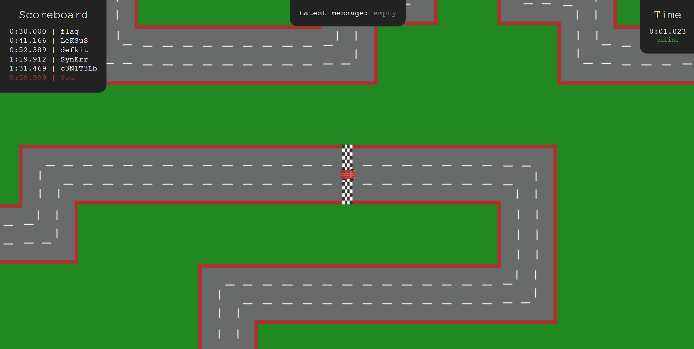
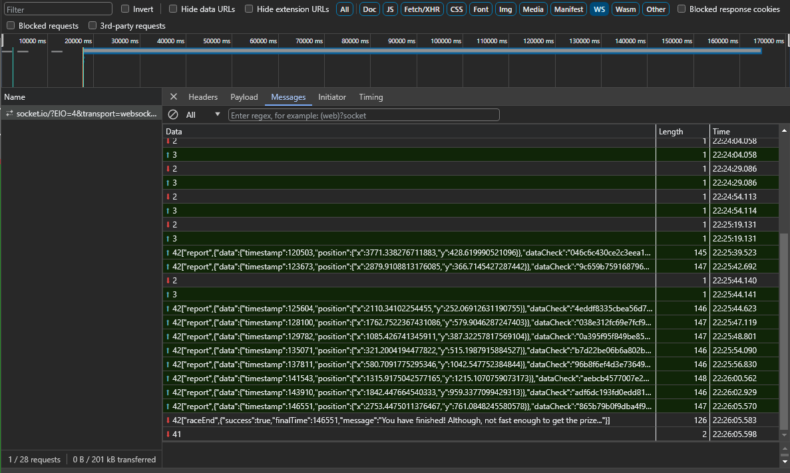
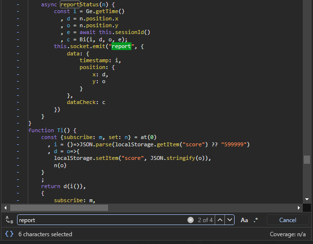
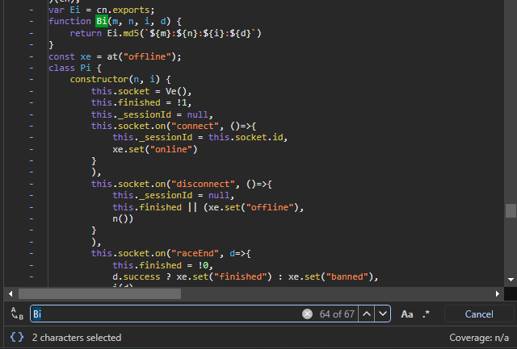
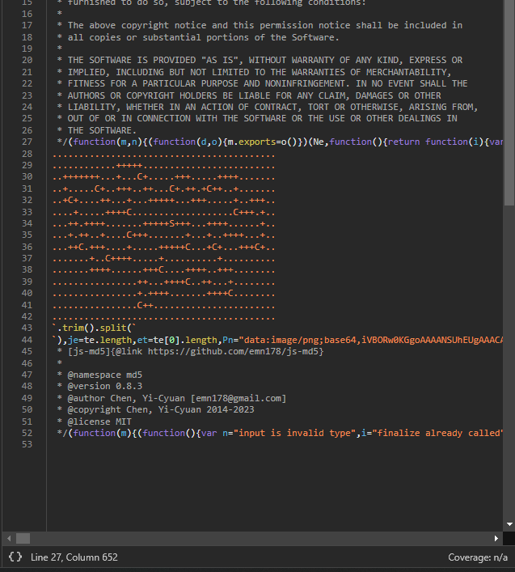

# Уличные гонки

_Author: [@LeKSuS-04](https://github.com/LeKSuS-04)_

> Давно не видел тебя в уличных гонках! Заходи!

## Решение

Участникам не выдавалось никаких исходников, а значит первым делом необходимо исследовать, с чем мы имеем дело.



Заходим на сайт, видим гоночный трек, а в углах таблицу результатов и таймер. Таблица результатов вполне однозначно намекает, что для того, чтобы получить флаг, надо проехать трек быстрее, чем за 30 секунд. Сначала, чтобы почуствовать азарт, попробуем проехать трек вручную. Скорее всего, спустя несколько попыток, получится приноровиться к управлению машины и установить рекорд около 40 секунд. Однако, до тех самых заветных 30 секунд ещё далеко. Да и не было бы это цтф таском, если бы его можно было пройти руками. Придется разбираться в том, как можно обмануть игру.

Для этого, первым делом, попробуем исследовать исходники страницы на вкладке "Sources" в девтулзах браузера. Видим, что код не написан руками, а скомпилирован из более высокоуровнего представления. Значит, чтение исходников клиентского кода для понимания взаимодействия с сервером будет нетривиальной задачей. Можно также заметить упоминания sveltekit в различных местах сорсов -- вероятно, с помощью этого фреймворка и разрабатывался сайт.

Далее попробуем заглянуть на вкладку "Network" (или запустить Burp Suite), чтобы посмотреть, в каком формате происходит общение с сервером. Видим, что сразу при открытии страницы устанавливается веб-сокет соединение. Присмотревшись к протоколу, узнаем в нем [socket.io](https://socket.io/).



На протяжении игры с клиента на сервер посылаются сообщения типа "report", содержащие примерно такую информацию:

```js
{
    data: {
        timestamp: 123,
        position: {
            x: 456,
            y: 789
        }
    },
    dataCheck: "e5be31d65a134fb2e399819f60624144"
}
```

Уже здесь можно попробовать написать простенький скриптик, чтобы заслать что-то похожее руками. Или поставить брейкпоинт в дебаггере браузера. Или перехватить пакет Burp Suite-ом. Вне зависимости от того, каким образом мы попробуем программно заслать какие-то данные, результат будет один -- скорее всего, мы получим сообщение:

```
["raceEnd",{"success": false, "message": "Bad checksum"}]
```

Сигнализирующее о том, что нас забанили. Логично предположить, что это из-за того, что поле `dataCheck` не совпало с нужным значением. Попробуем разобраться с тем, как оно генерируется. Так как сообщение имеет тип `"report"`, вполне разумно поискать по этой подстрочке в скомпилированных исходниках что-нибудь интересное. Находим вот эту функцию:



Которая отправляет данные как раз в том формате, в котором нам нужно -- мы на верном пути. Видим, что `dataCheck` вычисляется из всех остальных данных, а также `sessionId` (который устанавливается при инициализации соединени с сервером через socket.io). Чуть выше можно найти код и самой функции:



Видим, что `dataCheck = md5(timestamp + ':' + x + ':' + y + ':' + sessionId)`. Проверяем, и убеждаемся в том, что теперь мы умеем подделывать запросы с клиента.

Осталось узнать, каким образом сервер понимает, что мы проехали круг и надо завершать гонку. Можно заметить, что "репорты" с клиента улетают только тогда, когда машина доезжает до определенной точки. Первая такая точка, например, находится на втором повороте трека. Или же можно случайно заметить в одном из js файлов очень интересную константу:



Несложно заметить, что она описывает трек; `S` обозначает точку старта, `+` -- дорогу, а `C`...

Тем или иным способом, доходим до идеи о том, что на треке есть несколько "чекпоинтов", которые надо проехать, а потом доехать до финиша, чтобы завершить гонку. Определить их положение можно, опять же, либо потестив ручками, в какой момент от клиент репортит состояние серверу, либо по константе из кода.

Попробовав собрать программно собрать чекпоинты, обнаруживаем, что сервер валидирует еще два параметра: можно получить сообщения `"Too fast"` (если поехать слишком быстро) и `"Invalid timestamp"` (если попытаться отправить сообщение, со временем <=, чем в предыдущем).

Также можно заметить, что можно начинать с любой клетки. То есть, можно послать первое сообщение с `timestamp = 0` из любой точки карты, и это засчитается за валидный старт. Таким образом можно моментально собрать один чекпоинт.

Еще один "хак", которым можно воспользоваться для ускорения -- возможность "проезжать" сквозь стены. На самом деле, необязательно догадываться до того, что сервер никак не проверяет коллизии со стенами. Достаточно лишь заметить, что клиент должен отправлять только координаты с чекпоинтов, а каким образом он до них добрался -- сервер никак не может определить. Поэтому в каждый момент времени можно "ехать" по самому короткому пути, по прямой, до следующего чекпоинта, а репортить состояние на сервер только в тот момент, когда клиент стоит на чекпоинте (то есть, гарантированно на дороге).

Таким образом, можно составить оптимальный маршрут, чтобы побить рекорд в 30 секунд и получить флаг. Даже необязательно догадываться до всех хитростей, ведущих к победе -- вот маршрут, по которому можно преодолеть все чекпоинты за `24370ms`, что оставляет окно, размером более чем в 5 секунд для неточностей и неаккуратностей. К тому же, автор предполагает, что существует более оптимальный маршрут, с помощью которого можно сэкономить еще больше времени.

```
..........................................
............+++++.........................
..+++++++...+...B+.....+++.....++++.......
..+.....C+..+++..++...A+.++.+9++..+.......
..+D+....++...+...+++++...+++.....+..+++..
....+.....++++H...................8+++.+..
...++.++++.......+++++I+++...++++......+..
...+.++..+....G+++.......+...+..++++...+..
...++E.+++....+.....+++++3...+6+...+++7+..
.......+..F++++.....+..........+..........
.......++++......+++2....++++..+++........
................++...++++4..++...+........
................+.++++.......++++5........
................1++.......................
..........................................
```
(двигаться по чекпоинтам в порядке 1 -> 2 -> 3 -> 4 -> 5 -> 6 -> 7 -> 8 -> 9 -> A -> B -> C -> D -> E -> F -> G -> H -> I)

Таким образом, остается лишь автоматизировать отправку сообщений на сервер в нужном порядке с нужными параметрами. Пример сплойта, который достает флаг, можно увидеть в файле [sploit/sploit.py](./sploit/sploit.py)

### Альтернативное решение

Во время проведения мероприятия мы обнаружили в логах, что большинство участников решают сервис, эксплуатируя другую, более простую ошибку. Точно так же, как в первом сообщении клиента можно указать любую позицию, в нем можно указать и любое время. Таким образом, можно начать с таймером, установленным в какое-то отрицательное значение. Таким образом можно не оптимизировать маршрут, а "добавить" себе времени, получив "фору" при старте.
