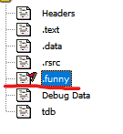
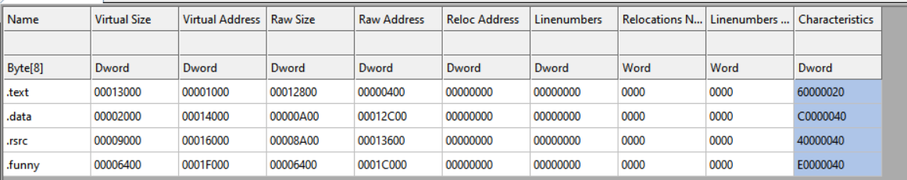
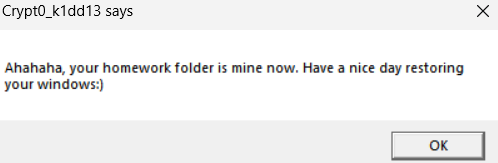
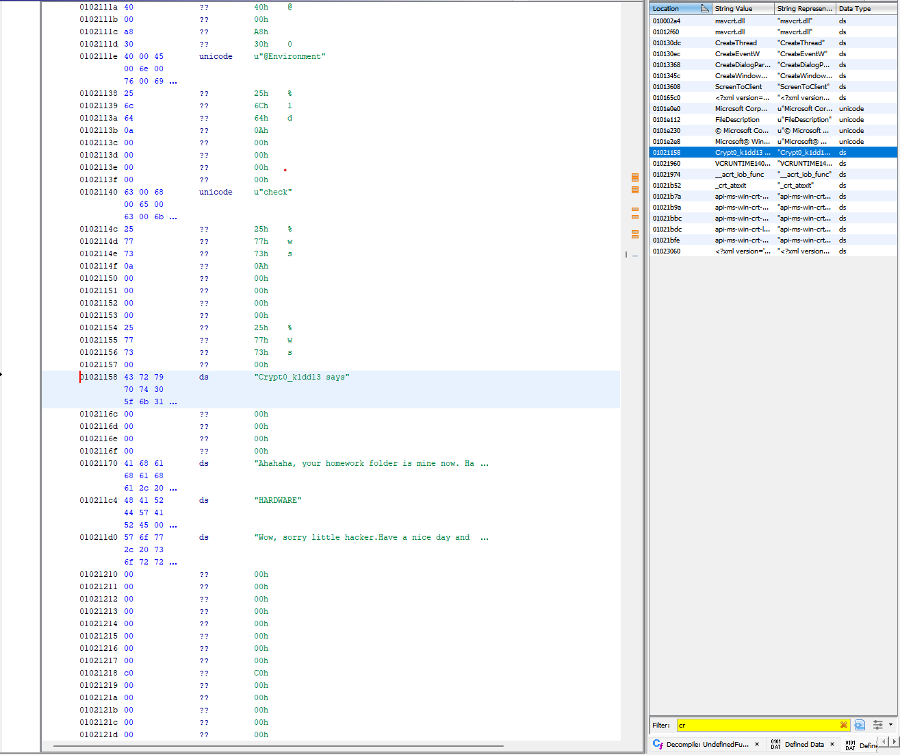
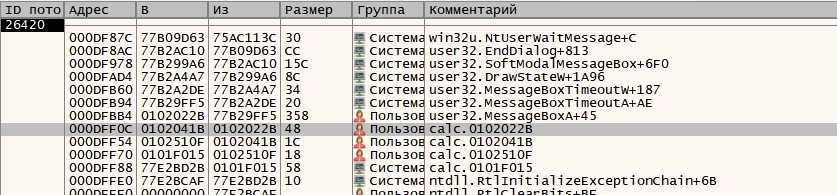
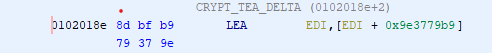

# MaminRepacker

Участник получает PE файл

## 1. EXE cannot execute?!

Нас попросили не запускать этот файл, значит не будем

Открываем файл в Ghidra и замечаем странную секцию:



Мало того EntryPoint указывает именно сюда, что не есть хорошо

Посмотрев на секцию через CFF Explorer видим что она размера аж 0x6400 байт



## 2. Ищем EntryPoint в шеллкоде

запускаем в виртуалке(предварительно делаем снапшот) и видим


Для начала поищем строчки в Ghidra:


Но они как будто нигде не используются

Значит пора открывать x32dbg.

Запускаем и останавливаем выполнение, когда появляется MessageBox. Заием открываем Стек вызовов:



Самая первая строка с комментарием начинающимся на calc(название нашей программы) и есть указатель на следующую после `call MessageBoxA` инструкцию

прыгаем туда в Ghidra и находим наш `main`:
```C
void main(void) {
  uint uVar1;
  int iVar2;
  uint uVar3;
  int iVar4;
  uint local_338 [5];
  undefined4 local_324;
  undefined4 local_320;
  undefined4 local_31c;
  int local_318;
  undefined4 local_314;
  undefined4 local_310;
  undefined4 local_30c;
  undefined local_308 [512];
  uint local_108 [64];
  uint local_8;
  
  local_8 = _DAT_00403000 ^ (uint)&stack0xfffffffc;
  local_338[0] = 0xa10f7f0a;
  local_338[1] = 0xa3c5018;
  local_338[2] = 0xd671dc2b;
  local_338[3] = 0xe021e3a;
  local_338[4] = 0xb7e17ee2;
  local_324 = 0x7166655;
  local_320 = 0x12b21b1f;
  local_31c = 0x4e130baa;
  FUN_01020dc0();
  local_310 = 1;
  local_30c = 0x1fe;
  (*_DAT_00402008)(0x80000001,0x402118,&local_314);
  (*_DAT_00402004)(local_314,0x402130,0,&local_310,local_308,&local_30c);
  (*_DAT_00402000)(local_314);
  FUN_01020dc0();
  FUN_01020010(local_108,0x40213c,(char)local_308);
  local_318 = 0;
  while( true ) {
    uVar3 = *(uint *)((int)local_108 + local_318);
    iVar4 = 0;
    uVar1 = *(uint *)((int)local_108 + local_318 + 4);
    iVar2 = 0x20;
    do {
      iVar4 += -0x61c88647;
      uVar3 += (uVar1 >> 5) + 0x896d5f40 ^ (uVar1 + 0x1540cb) * 0x10 ^ iVar4 + uVar1;
      uVar1 += uVar3 * 0x10 + 0x157e29a2 ^ (uVar3 >> 5) + 0xfb71d38 ^ iVar4 + uVar3;
      iVar2 += -1;
    } while (iVar2 != 0);
    if ((uVar3 != *(uint *)((int)local_338 + local_318)) ||
       (uVar1 != *(uint *)((int)local_338 + local_318 + 4))) break;
    local_318 += 8;
    if (0x1f < local_318) {
      (*_DAT_00402048)(0,0x4021b8,0x402140,0);
      FUN_0102024e(local_8 ^ (uint)&stack0xfffffffc);
      return;
    }
  }
  (*_DAT_00402048)(0,0x402158,0x402140,0);
  (*_DAT_0040200c)(0x80000002,0x4021ac);
  FUN_0102024e(local_8 ^ (uint)&stack0xfffffffc);
  return;
}
```

## 4. Исправляем код

Не закрывая дебаггер исправляем функции на правильные и получаем:

```C
void main(void) {
  uint uVar1;
  int iVar2;
  uint uVar3;
  int iVar4;
  uint flagEnc [5];
  undefined4 local_324;
  undefined4 local_320;
  undefined4 local_31c;
  int index;
  undefined4 hkey;
  undefined4 type;
  undefined4 size;
  undefined nonPreparedFlag [512];
  uint checkFlag [64];
  uint local_8;
  
  flagEnc[0] = 0xa10f7f0a;
  flagEnc[1] = 0xa3c5018;
  flagEnc[2] = 0xd671dc2b;
  flagEnc[3] = 0xe021e3a;
  flagEnc[4] = 0xb7e17ee2;
  flagEnc[5] = 0x7166655;
  flagEnc[6] = 0x12b21b1f;
  flagEnc[7] = 0x4e130baa;
  type = 1;
  size = 0x1fe;
  RegOpenKeyW(0x80000001,"Environment",&hkey);
  RegQueryValueExW(hkey,"check",0,&type,nonPreparedFlag,&size);
  RegCloseKey(hkey);
  sprinf(checkFlag,"%ws",(char)nonPreparedFlag);
  index = 0;
  while( true ) {
    uVar3 = checkFlag[index];
    iVar4 = 0;
    uVar1 = checkFlag[index + 1];
    iVar2 = 0x20;
    do {
      iVar4 += -0x61c88647;
      uVar3 += (uVar1 >> 5) + 0x896d5f40 ^ (uVar1 + 0x1540cb) * 0x10 ^ iVar4 + uVar1; // 0x1540cb0 - key1 | 0x896d5f40 - key2
      uVar1 += uVar3 * 0x10 + 0x157e29a2 ^ (uVar3 >> 5) + 0xfb71d38 ^ iVar4 + uVar3; // 0x157e29a2 - key3 | 0xfb71d38 - key4
      iVar2 += -1;
    } while (iVar2 != 0);
    if ((uVar3 != flagEnc[index] || (uVar1 != flagEnc[index + 1]))) break;
    index++;
    if (8 < index) {
      MessageBoxA(0, "Wow, sorry little hacker.Have a nice day and download this anywhere else)", "Crypt0_k1dd13 says", 0);
      return;
    }
  }
  MessageBoxA(0, "Ahahaha, your homework folder is mine now. Have a nice day restoring your windows:)", "Crypt0_k1dd13 says", 0);
  RegDeleteKeyA(HKEY_LOCAL_MACHINE, "HARDWARE");
  return;
}
```
А далее у нас появляется очкень удобная подсказка для обладателей FindCrypt плагина:


Значит это TEA шифрование. Найдя страничку на википедии копируем decrypt функцию. Посмотрев на encrypt находим в Ghidra ключи и пишем следующий код:

```Python
import ctypes

def TEAdecrypt(v, k):
    v0=ctypes.c_uint32(v[0])
    v1=ctypes.c_uint32(v[1])
    sum=ctypes.c_uint32(0xC6EF3720) 
    delta=ctypes.c_uint32(0x9E3779B9)                   
    k0=ctypes.c_uint32(k[0])
    k1=ctypes.c_uint32(k[1])
    k2=ctypes.c_uint32(k[2])
    k3=ctypes.c_uint32(k[3]) 
    for i in range(32):                    
        v1.value -= ((v0.value<<4) + k2.value) ^ (v0.value + sum.value) ^ ((v0.value>>5) + k3.value)
        v0.value -= ((v1.value<<4) + k0.value) ^ (v1.value + sum.value) ^ ((v1.value>>5) + k1.value)
        sum.value -= delta.value
                                       
    v[0]=v0.value
    v[1]=v1.value
    return v


flag = b''
enc_flag = [0xa10f7f0a, 0xa3c5018, 0xd671dc2b, 0xe021e3a, 0xb7e17ee2, 0x7166655, 0x12b21b1f, 0x4e130baa]
key = [0x1540cb0, 0x896d5f40, 0x157e29a2, 0x0fb71d38]

dec = []
for i in range(0,len(enc_flag),2):
    dec += TEAdecrypt(enc_flag[i:i+2], key)
ans = b''.join([i.to_bytes(4, 'little') for i in dec])
print(ans)
```

В итоге, получаем флаг:

`nto{TyP1c4L_CRypt0_Gu3s5_T4Sk}`