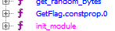
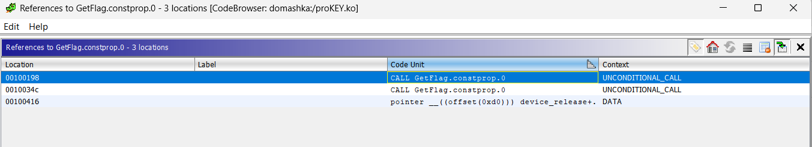

# ProKEY

Участник получает Linux Kernel object

## 1. КЕРНЕЛ ЭТО ОЧЕНЬ СЛОЖНА!!1!1!!:confounded:

Открываем файл в Ghidra:



УРА есть функция **GetFlag**:

```C
void GetFlag.constprop.0(byte param_1)

{
  long lVar1;
  long lVar2;
  byte bVar3;
  byte bVar4;
  
  __fentry__();
  lVar1 = vmalloc(0x23);
  bVar4 = 0x75;
  bVar3 = 0x76;
  lVar2 = 0;
  while( true ) {
    *(byte *)(lVar1 + lVar2) = bVar3 ^ bVar4 ^ param_1;
    if (lVar2 + 1 == 0x22) break;
    bVar3 = key[lVar2 + 1];
    bVar4 = crypted[lVar2 + 1];
    lVar2 = lVar2 + 1;
  }
  *(undefined *)(lVar1 + 0x22) = 0;
  return;
}
```

Тыкаем правой кнопкой мыши и ищем откуда она вызывается



* 00100198 - **device_open**
* 0010034c - **init_module**

В обоих функциях в качестве аргумента кладется глобальная переменная **XORKey**, однако в **init_module** мы ее инициализируем


## 2. Крипта

XORKey инциализируется так:
```C
        while( true ) {
          iVar1 = strncmp((char *)&local_1c,"nto",3);
          if (iVar1 != 0) break; // if(local_1c != "nto"){break;} 
          get_random_bytes(&XORKey,1);
          __src = (char *)GetFlag.constprop.0(XORKey);
          strncpy((char *)&local_1c,__src,4);
          vfree(__src);
        }
```

Следовательно XORKey изначально берется неверно, значит нужно сбрутить такой, чтобы итоговая строка начиналась на "nto":

```Python
key = b'vfxW848EW86wOkznlofHdx2TN01tGxVlgR'
crypted = [0x75,0x7f,0x7a,0x41,0x3e,0x6a,0x27,0x46,0x9,0x39,0x4,0x75,0x40,0x6c,0x24,0x60,0x75,0x71,0x54,0x14,0x3c,0x7b,0x2b,0x66,0x14,0x35,0x68,0x6d,0x75,0x7d,0xf,0x73,0x6e,0x42]

def decrypt(a, b, c): # GetFlag in Python
    ret = []
    for i in range(len(a)):   
        ret.append(a[i] ^ b[i] ^ c)
    if ret[0] == b'n'[0] and ret[1] == b't'[0] and ret[2] == b'o'[0]: # Searching for correct XORkey 
        return ''.join([chr(i) for i in ret])
    else:
        return None

for xorkey in range(0xff): 
    s = decrypt(key, crypted, xorkey)
    if s != None:
        print(s)
```

В итоге, получаем флаг:

`nto{k3rn3l_obj3cts_15nt_7h4t_h4rd}`