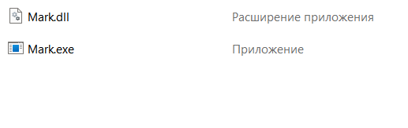
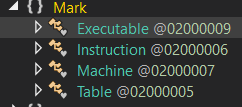
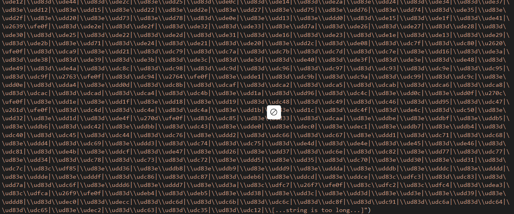

# ReLax

Участник получает ZIP файл с компилятором и адрес на сервер, который просит написать реверс слова

## 1. Dll's?

Открываем архив:



Видим dll файл, а значит пора открывать dnSpy

## 2. .NET

В dnSpy видим следующие классы:




### class Executable
#### Main
Проверяем, что у программы есть два аргумента. Первый файл
```C#
			if (!File.Exists(args[0]))
```
второй, видимо, строка.

Создаем объект **Machine**

Запускаем его методы

### class Machine
#### Machine
В конструкторе первая же строка превращается в :astonished:



А в прочем это же Emoji :smiley:

И спустя два веселых цикла осознаем, что в 1-й строке мы забираем все emoji

далее разбиваем по строкам и оставляем только `⬇️➡️▶️❌0️⃣1️⃣2️⃣3️⃣4️⃣5️⃣➕`

и берем только те строки где есть :arrow_right: или :arrow_forward:

в переменную класса **buffer** записыаем **input**

устанавливаем **index** в 0

#### Step

Добавляем к **buffer** в начале и конце ❌ и делаем замену

Если замена прошла удачно(мы что-то заменили) увеличиваем **index**

Если **Instruction.state == 1** или **index > instructions.Length()** прекращаем выполнение

### Table и Instruction

Типчные структурки

```C#
internal class Table
	{
		// Token: 0x04000003 RID: 3
		[Nullable(1)]
		public char[] alpha = new char[]
		{
			":arrow_down:".GetEmoji().Raw[0],
			":arrow_right:".GetEmoji().Raw[0],
			":arrow_forward:".GetEmoji().Raw[0],
			"❌"[0],
			":zero:".GetEmoji().Raw[0],
			":one:".GetEmoji().Raw[0],
			":two:".GetEmoji().Raw[0],
			":three:".GetEmoji().Raw[0],
			":four:".GetEmoji().Raw[0],
			":five:".GetEmoji().Raw[0],
			":heavy_plus_sign:".GetEmoji().Raw[0]
		};
	}
```

```C#
internal class Instruction
{
		// Token: 0x06000007 RID: 7 RVA: 0x000021B8 File Offset: 0x000003B8
		public Instruction(string l, string r, int t)
		{
			this.left = l;
			this.right = r;
			this.type = t;
		}

		// Token: 0x04000004 RID: 4
		public string left;

		// Token: 0x04000005 RID: 5
		public string right;

		// Token: 0x04000006 RID: 6
		public int type;
}
```

#### ИТОГО

Мы имеем систему алгоритмов построенных по принципу замен

```
Умный пользователь гугл мог найти что это крайне похоже на МаШиНу МаРкОВа
```

где:
❌ => поможет взять первый/последний элемент
:arrow_right: => замена формата (чего заменить):arrow_right:(на что меняем) 
:arrow_forward: => конеченая замена

осталось написать код

## 3. Writing code

По заданию нам нужно перевернуть слово состоящее из 1 и 0:

```
0️⃣1️⃣2️⃣➡️1️⃣2️⃣0️⃣ #
1️⃣1️⃣2️⃣➡️1️⃣2️⃣1️⃣ #
1️⃣0️⃣2️⃣➡️0️⃣2️⃣1️⃣ #
0️⃣0️⃣2️⃣➡️0️⃣2️⃣0️⃣ #

1️⃣2️⃣➡️1️⃣ *
0️⃣2️⃣➡️0️⃣ *

⬇️1️⃣➡️1️⃣2️⃣⬇️ /
⬇️0️⃣➡️0️⃣2️⃣⬇️ /

⬇️❌➡️❌ $

❌➡️⬇️ I
```

Я использовал следующие дополнения для работы алгоритма:

* разделитель слова => ⬇
* индекс => `2️⃣`

Алгоритм состоит из 5 основных сегментов:

* \# => Перемещаем влево пока не дойдем до ❌
* \* => Когда дошли до ❌ убираем индекс
* / => Берем элемент
* $ => Завершаем когда дойдем до конца
* I => Ставим разделитель в начале слова(выполнится один раз в начале программы)

В итоге, получаем флаг:

`nto{M4rk0v_m4ch1n3_4lg0ri7hm5_4r3_5tunn1ng}`
