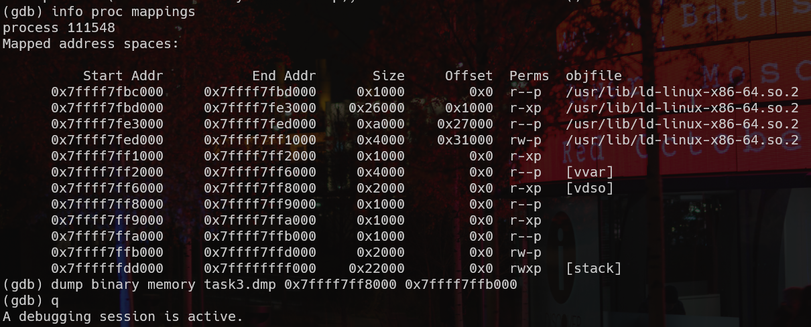
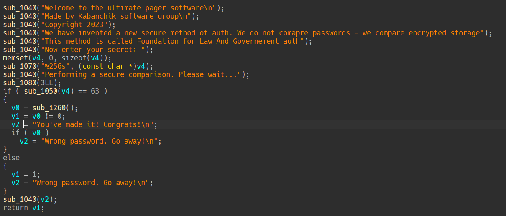

# Tosi-Bosi

Участник получает ELF файл, который просит на ввод флаг для проверки

## 1. Per aspera ad astra

Попытка подать случайные данные на ввод программы, очевидно, ни к чему не приводит.

Поиск по строкам тоже ничего особо не даёт (по крайней мере пока). Попытка отслеживания системных вызовов в том числе не увенчалась успехом - там (по крайней мере для нас) мусор:


При загрузке исполняемого файла в IDA Pro (или любой другой декомпилятор) получим следующую картину.


Судя по количеству функций и их содержанию, файл пошифрован и/или упакован. Надо бы выяснить, ~~а под чем он~~ чем был упакован данный исполняемый файл.

## 2. Desine sperare qui hic intras

Для восстановления оригинального ELF нам надо найти точку входа упаковщика. Поиск по строкам даёт нам упоминание упаковщика UPX. Думаем, что вот оно, счастье, пытаемся распаковать с помощью `upx -d`, однако:


Значит, придётся распаковывать ручками.

## 3. Terra incognita

Поскольку UPX достаточно известный упаковщик и, кроме того, имеет открытый исходный код, существует достаточно материала по нему. 

Если описывать всё вкратце, то для нас важно, что после подготовки памяти вызывается munmap.

Тогда, ловим сисколл в отладчике и дампим следующей последовательностью команд

```bash
gdb task
catch syscall munmap
run
c
info proc mappings
dump binary memory %dump name% %start_addr% %end_addr%
```

Адреса начала и конца дампа можно выяснить как раз из `info proc mappings`:



Секции с libc, а так же `[stack]`, `[vvar]` и `[vdso]` Дампим.

Однако хоть и дамп определяется как валидный ELF файл (попробуйте сами: `file dump.dmp`), он не запустится. Вся соль в том, что просто сдампив, мы уничтожили все импорты и поэтому теперь запустить мы не можем. Конечно, существуют утилиты по восстановлению импортов после дампа, но они уже старые, а некоторые и вообще являюся PoC (proof-of-concept).

Поскольку успеха на динамическом поле мы не возымели, идём в IDA Pro (или другой ваш любимый дизассемблер)

## 4. Dura lex sed lex

Поиск по строкам бинаря теперь даёт какие-то результаты:


Переходя по строкам, попадаем в функцию, которая подозрительно похожа на `main()`



Однако, переходя в функцию `sub_1260()` (именно она нас интересует, `sub_1050()` - поломанная библиотечная функция), мы попадаем на поле брани:


Однако не всё так страшно. Присмотревшись, видим xor, byteswap (смену little-endian на big-endian и обратно), сравнение по 4 байта.

Основные выкладки таковы:

- dword_2010 - наш зашифрованный флаг + ключ
- 0x478e64f405c99297 - ключ
- Алгоритм шифрования:

    * восттановление из числа со сменой big endian на little endian
    * xor с зацикленным ключом
    * запись результата в массив int
    * сравнение по 4 байта (как раз по 1 int) с шифротекстом

## 5. Veni vidi vici

В конце, концов, написав следующий скрипт, получаем желаемый нами флаг:

```python
def cyclic_xor(cipher, key_b):
    res = []
    key_pos = 0;
    for i in range(len(cipher)):
        res.append(cipher[i] ^ key_b[key_pos])
        key_pos = (key_pos + 1) % len(key_b)

    return res 

enc = [
		0x29fa0b8f,
		0x7cfdcde4,
		0x23bd0895,
		0x6996a1e3,
		0x28fa3b80,
		0x31baf9c8,
		0x3dba3b9a,
		0x36ada1fb,
		0x3efb3b8d,
		0x3196e1a6,
		0x3de611ab,
		0x7396e2a7,
		0x23f85098,
		0x6096e2a7,
		0x2abe03c5,
		0x71faeff6
]

key = 0x478e64f405c99297

enc = b''.join([int.to_bytes(i, 4, byteorder='big') for i in enc])
key = int.to_bytes(key, 8, byteorder='big')


flag = cyclic_xor(enc, key)
flag = ''.join([chr(i) for i in flag])

print(flag)
```

В итоге, получаем флаг:

`nto{y4_sd3lal_3tot_t4sk_z4_n3d3lyu_y4_s1zhu_v_p0dv4le_p0m0g1t3}`
