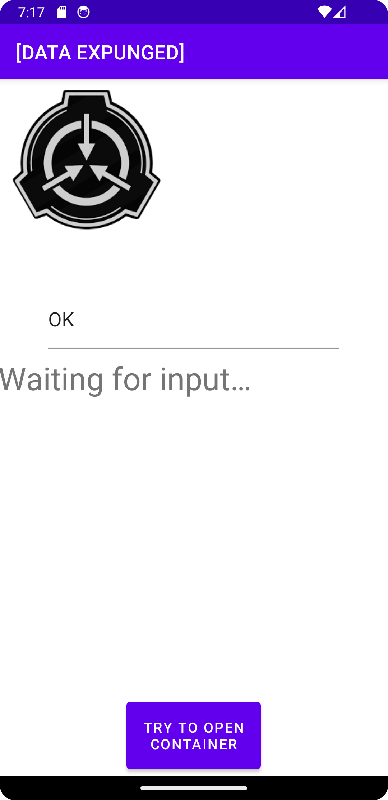
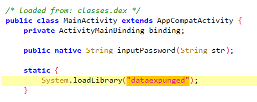
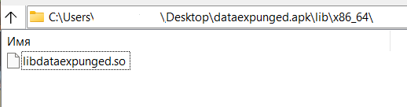
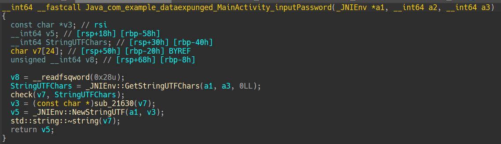
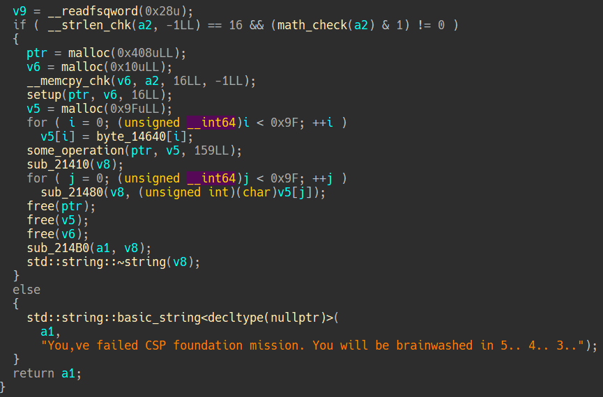
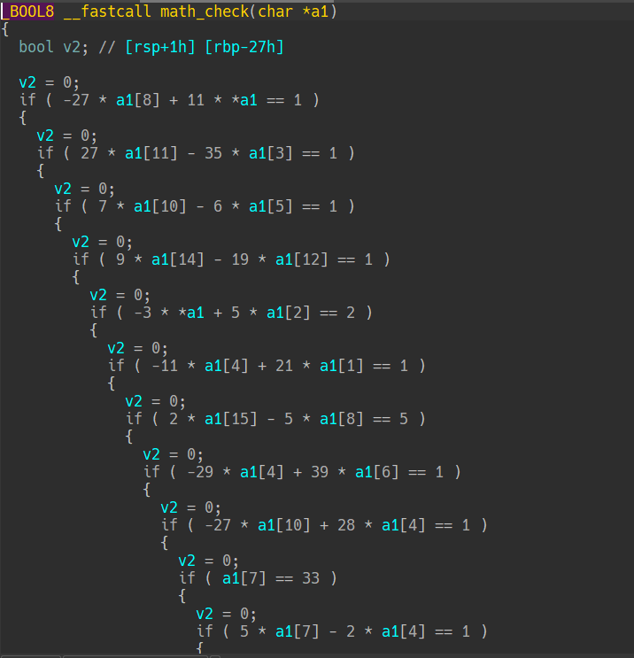

# [DATA EXPUNGED]


## 1. Разведка на местности

Имеем apk файл. При попытке его запустить (внутри эмулятора или на родном Xiaomi, нет никакой разницы) нас встречает окно следующего содержания:



Требуется ввод пароля.

При попытке ввести случайные данные ничего не произошло, что ожидаемо. Поэтому переходим в JADX и грузим apk туда.

## 2. Соединяем два берега мостом

Загрузив apk в JADX, осматриваемся. Вроде бы ничего подозрительного, как вдруг замечаем, что у нас в коде используется JNI:



Небольшое отступление - JNI - технология, позволяющая использовать C/C++ в приложениях под Android (например для сложных по ресурсам вычислений). Поскольку в коде на Java ничего криминального мы не заметили, будем искать желаемую проверку внутри этих библиотек.

## 3. O tempora o mores

Заглянем в ресурсы (именно там хранятся наши библиотеки). Имеем папку `lib`, в которой лежат .so файлы:



Достанем их (с помощью jadx, либо можно распаковать apk с помощью, например, `unzip task.apk`) и заглянем в ту же директорию. Отправляем наши библиотеки под нож в IDA Pro (или другой ваш любимый дизассемблер). Для исследования возьмём x86_64 вариант, так как он нам прост и понятен.

## 4. Dura lex sed lex

Поскольку отладить мы это по человечески не сможем (можно, конечно, подключить к этому делу frida, но это достаточно запарно), будем ревёрсить в статике. Смотрим на главную функцию, которая импортируется в MainActivity.java:



Далее, переходим в функцию `check()`:



Замечаем функцию с интересным названием `math_check()`. Переходим:



Здесь мы видим проверку ввода, на основании которой в `check()` идёт исполнение дальше.

## 5. Dictum factum

Попробуем решить эти уравнения. Для этого можно использовать Z3 + Python. В конце - концов получаем примерно похожий скрипт:

```Python
from z3 import *

s = Solver()
xs = [Int(f"x_{i}") for i in range(16)]

s.add(11 * xs[0] + -27 * xs[8] == 1)
s.add(-35 * xs[3] + 27 * xs[11] == 1)
s.add(-6 * xs[5] + 7 * xs[10] == 1)
s.add(-19 * xs[12] + 9 * xs[14] == 1)
s.add(5 * xs[2] + -3 * xs[0] == 2)
s.add(21 * xs[1] + -11 * xs[4] == 1)
s.add(-5 * xs[8] + 2 * xs[15] == 5)
s.add(39 * xs[6] + -29 * xs[4] == 1)
s.add(28 * xs[4] + -27 * xs[10] == 1)
s.add(1 * xs[7] + 0 * xs[5] == 33)
s.add(-2 * xs[4] + 5 * xs[7] == 1)
s.add(-3 * xs[10] + 4 * xs[3] == 1)
s.add(2 * xs[13] + -3 * xs[1] == 1)
s.add(-19 * xs[9] + 30 * xs[3] == 1)
s.add(-1 * xs[4] + 1 * xs[11] == 1)
s.add(23 * xs[13] + -18 * xs[11] == 1)
s.add(-4 * xs[6] + 7 * xs[8] == 1)
s.add(46 * xs[14] + -51 * xs[9] == 1)
s.add(13 * xs[12] + -16 * xs[1] == 1)
s.add(-11 * xs[4] + 21 * xs[1] == 1)
s.add(9 * xs[14] + -19 * xs[12] == 1)
s.add(0 * xs[0] + 1 * xs[1] == 43)
s.add(14 * xs[11] + -27 * xs[1] == 1)
s.add(28 * xs[10] + -39 * xs[6] == 1)
s.add(19 * xs[8] + -8 * xs[11] == 1)
s.add(11 * xs[14] + -15 * xs[4] == 2)
s.add(-21 * xs[15] + 31 * xs[6] == 1)
s.add(-8 * xs[12] + 5 * xs[10] == 1)
s.add(27 * xs[2] + -23 * xs[6] == 1)
s.add(5 * xs[0] + -13 * xs[7] == 1)

res = []

if (s.check() == sat):
    for i in xs:
        res.append(s.model()[i])

    res = ''.join([chr(i.as_long()) for i in res])
    print(res)
else: 
    print("UNSAT :(")
```

Запустив, получаем следующую строку:

```text
V+4@Rc=!#eUS5ApZ
```

## 6. Cogito ergo sum

Если есть возможность запустить приложение, проверяем, введя ключ в поле ввода в приложении. В итоге мы получим сообщение, внутри которого - флаг.

Если приложения нет, то идём по следующему пути:

## 6.1. Per aspera ad astra

В функции `check()` мы видили `some_operation()` и `setup()`

Эти функции есть ни что иное, как реализация шифра RC4. Но даже если не хватает опыта, чтобы это понять, то можно действовать следующим образом:

1. Заметим, что операция, изменяющая наш ключ - XOR.
2. Вспомним, что эта операция при повторении даёт изначальные данные
3. Тогда, можно просто провести те же самые действия как для шифрования, так и для расшифрования.
4. Достанем пошифрованные данные из бинаря (например, через `get_bytes()` в IDA)
5. Пишем скрипт, расшифровываем
6. ???
7. PROFIT

Либо, если мы знаем, что это RC4, то можно просто написать следующий скрипт:

```Python
from Crypto.Cipher import ARC4

enc = [0x23,0x6e,0xc8,0x59,0x5a,0x78,0x23,0x2c,0xcd,0x19,0x69,0xff,
       0xd3,0x76,0xdb,0x0d,0x68,0x32,0xb9,0x15,0xbe,0x22,0x36,0xe4,
       0x5e,0x1f,0x88,0xe4,0x4c,0x1e,0x62,0x05,0x9b,0x5d,0x54,0x9b,
       0xe3,0xa6,0x14,0xba,0x0c,0x2b,0x3f,0x40,0xbb,0xc0,0x98,0xc3,
       0xe6,0x35,0x47,0x7a,0x24,0x5c,0xb6,0xec,0x4d,0x6b,0x77,0xc2,
       0x59,0xc7,0xfc,0xda,0x4e,0x79,0x9f,0x31,0x2e,0xdc,0xce,0x84,
       0x38,0xab,0x63,0xd8,0x3b,0xe6,0xbd,0x96,0xd1,0x8b,0x09,0xb3,
       0x73,0x0c,0x95,0xdc,0xa2,0xd1,0x14,0x60,0x23,0x3e,0xd4,0x8e,
       0x72,0x61,0xb2,0x4a,0xf7,0x40,0x7f,0x1b,0x45,0x9b,0x56,0xaa,
       0x43,0x8e,0x6a,0x5c,0x4c,0x3a,0x7d,0x6c,0xa7,0x0e,0xae,0x4c,
       0x27,0x13,0x73,0x6e,0xc3,0x95,0x3d,0xcc,0x2a,0x92,0xd7,0x95,
       0x94,0xc8,0x67,0xa4,0x10,0x07,0x49,0x05,0xe7,0xcf,0x5c,0x70,
       0x35,0xcf,0xbc,0x93,0xf3,0x57,0x44,0xf3,0x7b,0x5b,0xc2,0x96,
       0x97,0x36,0xe9]

enc = bytes(enc)

key = b'V+4@Rc=!#eUS5ApZ' # ключ мы получили на предыдущей стадии
cipher = ARC4.new(key)

print(cipher.encrypt(enc))

```

В конце концов, получаем флаг:

```text
nto{f0und4ti0n_th4nks_y0u_1_k0shk0_zh3na_v_p0d4rok}
```
